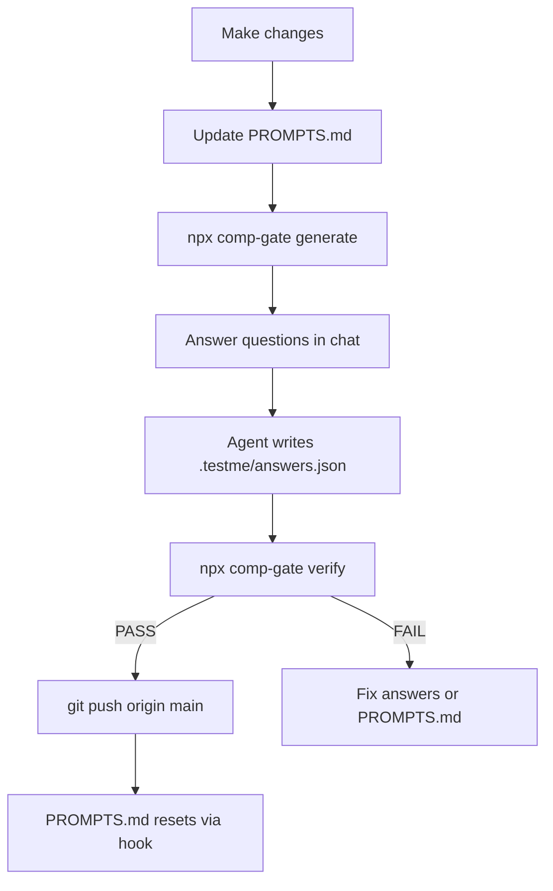

# testme

Comprehension gate for desktop coding agents. **testme** blocks `git commit` (when enabled) and `git push` to protected branches until you pass a comprehension test describing what changed.

Published on npm as [`comp-gate`](https://www.npmjs.com/package/comp-gate). The CLI command is `comp-gate` (alias: `testme`).

## Quick start

```bash
npx comp-gate init
```

The setup wizard detects your desktop agent (Cursor, Claude Code, Windsurf), asks how many questions you want, how difficult they should be, whether to keep agent skills local-only in `.gitignore`, and whether to start with a blank `SUMMARY.md` or generate one from project metadata, then installs the integration.

Non-interactive example:

```bash
npx comp-gate init --agent cursor --questions 3 --difficulty medium --local-only true --summary blank --yes
```

### Adopting an existing repository

During `init`, the wizard asks how to set up `SUMMARY.md`:

- **Blank (default)** — empty template; you fill in stack, layout, and conventions once. Best for large or monorepo codebases.
- **Generate** — drafts `SUMMARY.md` from README, manifests, and top-level folders only (not a full codebase scan).

On repos with **500+ tracked files**, the wizard recommends blank and warns that auto-generation is often shallow or misleading at that scale.

- Large repos: prefer blank — a hand-written map at package/layer granularity beats a shallow auto-draft.
- Staleness: generated summaries reflect init-time metadata and need manual upkeep.
- Token efficiency: comp-gate reads `SUMMARY.md` for architecture questions; keep it short and accurate.

See [adopting existing repos](https://github.com/ROrmand/comp-gate/blob/main/docs/adopting-existing-repos.md) for the full guide.

```bash
npx comp-gate init --summary blank    # default
npx comp-gate init --summary generate # draft from README + manifests
```

### What gets installed

**Committed (team-shared):**

- `SUMMARY.md` — stable project map (blank template or generated from project metadata at init)
- `PROMPTS.md` — session change log (resets after successful push to `main`)
- `testme.config.json` — question count, difficulty, protected branches
- `AGENTS.md` — portable workflow section (when selected)

**Local only (gitignored — each developer runs `npx comp-gate init` after clone):**

- `.testme/` — session state and hook scripts
- `.cursor/skills/testme/`, `.cursor/skills/testing/`, `.claude/skills/testme/`, `.claude/skills/testing/`, `.windsurf/skills/testme/`, `.windsurf/skills/testing/` — agent skills
- Agent hook configs (`.cursor/hooks.json`, `.claude/settings.json`, `.windsurf/hooks.json`) when testme-only

**Always installed per machine:**

- `.git/hooks/pre-commit` and `pre-push` — blocks commit/push in any terminal

### Supported agents

| Agent | Integration |
|-------|-------------|
| Cursor | `.cursor/hooks.json` + `/testme` and `/testing` skills |
| Claude Code | `.claude/settings.json` PreToolUse hooks + skills |
| Windsurf | `.windsurf/hooks.json` pre_run_command hooks + skills |
| AGENTS.md | Portable workflow docs (fallback) |

Git hooks are the universal safety net when agent shell hooks are unavailable (e.g. some Claude Desktop sessions).

## Toggle gating with `/testing`

Use `/testing` in chat (or `npx comp-gate testing`) to turn the comprehension gate on or off **locally** — state is stored in `.testme/config.json` (gitignored), so one developer can pause gating without changing team config.

| Skill / command | Purpose |
|-----------------|---------|
| `/testing` | Toggle gate on/off (default) |
| `npx comp-gate testing on` | Enable gating |
| `npx comp-gate testing off` | Disable gating (commit/push no longer require `/testme`) |
| `npx comp-gate testing status` | Show current state with status banner |
| `/testme` | Run comprehension workflow (only when gate is on) |

When the gate is **off**, hooks allow commit and push without verification. Re-enable before pushing to protected branches in team workflows.

### Status line indicator

For a persistent on/off indicator above the Cursor prompt, add this to `~/.cursor/cli-config.json`:

```json
{
  "statusLine": {
    "type": "command",
    "command": "sh -c 'cd \"$PWD\" && .testme/hooks/statusline.sh'",
    "padding": 2
  }
}
```

`npx comp-gate init` installs `.testme/hooks/statusline.sh`, which runs `npx comp-gate statusline`:

- Gate on: `🟢 testme`
- Gate off: `🔴 testme off`

Running `/testing` also prints an in-chat banner:

```
┌─────────────────────────┐
│  testme gate:  ON  🟢   │
└─────────────────────────┘
```

## Workflow



### 1. Document changes in PROMPTS.md

```markdown
# Session Changes

## src/auth.ts
- Added validateToken middleware; checks JWT expiry before route handlers
```

Write bullets as you work — they become the answer rubric.

### 2. Generate questions

```bash
npx comp-gate generate
```

Reads `SUMMARY.md`, `PROMPTS.md`, and git diff only. Produces 3–5 targeted questions in `.testme/session.json`.

### 3. Answer questions (in chat)

Run `/testme` in Cursor. The agent asks each question one at a time in chat — reply in plain messages. The agent writes `.testme/answers.json` from your replies before verifying.

For each question, read only the files listed in that question's `files[]` array if you need to check your answer.

### 4. Verify (semantic grading)

The agent generates reference answers, asks you questions in chat, then grades your replies with an **accuracy score (0–100)** and **alignment** (`low` / `medium` / `high`) per question. Default pass threshold is **70%** accuracy (`passThreshold` in config).

```bash
npx comp-gate verify
```

On pass, `.testme/pass.json` is written.

### 5. Push

```bash
git push origin main
```

After a successful push, `PROMPTS.md` resets automatically.

## Commands

| Command | Description |
|---------|-------------|
| `comp-gate init` | Interactive setup wizard: detect agent, configure questions/difficulty, install hooks and skills |
| `comp-gate init --agent all --yes` | Install all agent integrations without prompts |
| `comp-gate init --questions 5 --difficulty hard --force` | Override question count and difficulty |
| `comp-gate hook install-git` | Re-install git `pre-commit` / `pre-push` hooks only |
| `comp-gate generate` | Generate questions from diff + md files |
| `comp-gate generate --max-questions 3` | One-off question count override |
| `comp-gate generate --category runtime,testing` | One-off category filter |
| `comp-gate detect` | Show auto-detected domain categories |
| `comp-gate config init` | Create `testme.config.json` with detected defaults |
| `comp-gate config show` | Print merged config (repo + local overrides) |
| `comp-gate verify` | Score answers in `.testme/answers.json` |
| `comp-gate status` | Check if current pass is valid and whether gate is enabled |
| `comp-gate testing` | Toggle comprehension gate on/off (local) |
| `comp-gate testing on` / `off` / `status` | Explicitly enable, disable, or show gate state |
| `comp-gate statusline` | One-line gate status for Cursor status line |
| `comp-gate reset` | Clear `.testme/` session state |

## Customization

### Protected branches and commit gating

Configure in `testme.config.json`:

```json
{
  "protectedBranches": ["main"],
  "gateCommits": true,
  "autoProtectCurrentBranch": true
}
```

- `protectedBranches` — always-protected branches (e.g. `main`)
- `autoProtectCurrentBranch` — also gate pushes to whatever branch you have checked out (default `true`)
- `gateCommits` — when `true`, `git commit` is blocked until `/testme` passes

Blocked push message: `You must run the /testme skill before pushing to 'main'.`

**Terminal blocking:** `npx comp-gate init` installs native git hooks into `.git/hooks/`. The Cursor integrated terminal does **not** run Cursor `beforeShellExecution` hooks — git hooks cover that gap.

### Question count and difficulty

Set during `comp-gate init` or in `testme.config.json`:

| Difficulty | Pass threshold | Alignment required | Categories |
|------------|----------------|--------------------|------------|
| easy | 60% | low+ | changeRationale, symbols |
| medium | 70% | medium+ | balanced + auto-detect |
| hard | 85% | high only | + architecture, runtime, security |

```json
{
  "questions": { "min": 2, "max": 3 },
  "difficulty": "medium",
  "passThreshold": 70,
  "minAlignment": "medium"
}
```

### Question count (generate)

Configure in `testme.config.json`:

```json
{
  "questions": { "min": 2, "max": 5 }
}
```

Local override in `.testme/config.json` (gitignored via `.testme/`):

```json
{ "questions": { "max": 3 } }
```

### Category checkboxes

Each category is a boolean in `categories`. Core categories work everywhere; domain categories are auto-suggested when relevant.

| Category | Focus |
|----------|-------|
| `changeRationale` | What changed per file and why |
| `symbols` | What added/changed symbols do |
| `architecture` | Fit with SUMMARY.md structure |
| `runtime` | Run, test, deploy impact |
| `dataStructures` | Algorithms and data structures used |
| `dependencies` | Package/manifest changes |
| `testing` | Test coverage and assertions |
| `errorHandling` | Errors and edge cases |
| `apiContracts` | API/schema/interface changes |
| `security` | Auth, validation, secrets |
| `performance` | Caching, complexity, bottlenecks |
| `database` | Schema, queries, migrations |
| `machineLearning` | Training, inference, metrics |
| `cybersecurity` | Threat model, mitigations |
| `frontend` | UI components and state |
| `backend` | Routes, middleware, services |
| `devops` | CI/CD, containers, infra |
| `mobile` | Platform-specific behavior |
| `dataEngineering` | Pipelines, ETL, lineage |

### Project-aware detection

```bash
npx comp-gate detect
```

Signals: `SUMMARY.md` `## Domain` section, `package.json`/`pyproject.toml` deps, diff file paths.

**ML example** — `comp-gate detect` enables `machineLearning`; disable `cybersecurity` in config.

**Security example** — enable `cybersecurity` and `security`; leave `machineLearning` false.

```json
{
  "autoDetect": true,
  "categories": {
    "machineLearning": true,
    "dataStructures": true,
    "cybersecurity": false
  }
}
```

Add to `SUMMARY.md`:

```markdown
## Domain

- Primary: machine learning
- Focus areas: model training, evaluation metrics, inference API
```

## Why PROMPTS.md matters

`PROMPTS.md` is the cheap answer key. Agents document changes as they work, so verification doesn't require re-reading full diffs or scanning the codebase. Better bullets → better rubrics → easier pass.

## Token efficiency

- No full-repo scans — only git diff metadata + two md files
- Configurable question count and categories via `testme.config.json`
- Semantic grading by default (agent compares your answers to reference answers)
- Targeted file reads via `files[]` pointers in session

## Troubleshooting

| Issue | Fix |
|-------|-----|
| Push blocked | Run `/testme` or `npx comp-gate generate` → answer → `verify` |
| Commit blocked | `gateCommits` is on — run `/testme` before committing |
| Session stale | Re-run `generate` after new edits |
| Missing terms | Add clearer bullets to `PROMPTS.md` |
| Pass invalid | `npx comp-gate status` — diff changed since verify |
| Gate disabled | Run `/testing` or `npx comp-gate testing on` to re-enable |

## Development

```bash
npm install
npm run build
npm test
```

### Publishing

```bash
npm login
npm publish
```

The package name on npm is `comp-gate` (the unscoped name `testme` is taken by an unrelated package). After publishing, users install with:

```bash
npx comp-gate init
```

## Limitations (v1)

- Symbol extraction uses regex (TS/JS/Python/Go patterns) — not a full AST parser
- Protected branches configurable via `protectedBranches` in `testme.config.json` (`--branch` flag to override)
- Optional commit gating via `gateCommits: true` in `testme.config.json`
- Verification is semantic by default (`grading: "semantic"`); legacy keyword mode available
