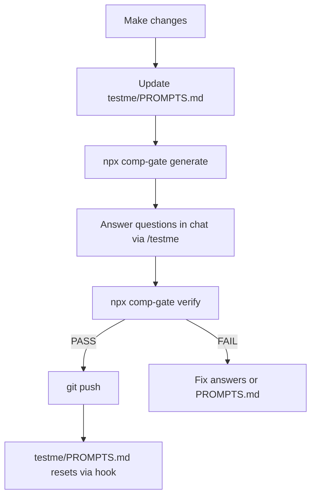

# testme

Comprehension gate for desktop coding agents. Blocks `git commit` (when enabled) and `git push` to protected branches until you pass a comprehension test.

Published on npm as [`comp-gate`](https://www.npmjs.com/package/comp-gate). CLI: `npx comp-gate` (alias: `testme`).

## Quick start

```bash
npx comp-gate init
```

The wizard detects your agent (Cursor, Claude Code, Windsurf), configures question count and difficulty, and installs everything into a single `testme/` folder.

Non-interactive:

```bash
npx comp-gate init --agent cursor --questions 3 --difficulty medium --local-only true --summary blank --yes
```

### What gets installed

```
testme/                          # committed (team-shared)
├── SUMMARY.md                   # project map
├── PROMPTS.md                   # session change log
├── config.json                  # question count, difficulty, protected branches
├── hooks/                       # shell hook scripts
└── skills/
    ├── testme/SKILL.md          # /testme workflow
    └── testing/SKILL.md         # /testing toggle

.testme/                         # gitignored (session state per developer)
├── session.json
├── answers.json
└── config.json                  # local gate toggle overrides
```

**Per machine (not in git):** `.git/hooks/pre-commit` and `pre-push` wrappers, plus agent bridge files (`.cursor/hooks.json`, skill symlinks) when `localOnly` is enabled.

**Migrating from v0.1.x?** Run `npx comp-gate migrate` to move root-level `SUMMARY.md`, `PROMPTS.md`, and `testme.config.json` into `testme/`.

## Using with your agent

### Cursor

After `init`, two skills are available in chat:

| Skill | Purpose |
|-------|---------|
| `/testme` | Run the comprehension workflow before commit/push |
| `/testing` | Toggle the gate on/off locally |

Cursor hooks in `.cursor/hooks.json` block `git commit` and `git push` in the integrated terminal. Git hooks in `.git/hooks/` cover all other terminals.

**Status line** — add to `~/.cursor/cli-config.json` for a persistent on/off indicator:

```json
{
  "statusLine": {
    "type": "command",
    "command": "sh -c 'cd \"$PWD\" && testme/hooks/statusline.sh'",
    "padding": 2
  }
}
```

### Claude Code

`init` merges PreToolUse hooks into `.claude/settings.json` and symlinks skills into `.claude/skills/testme/` and `.claude/skills/testing/`.

### Windsurf

`init` merges `pre_run_command` hooks into `.windsurf/hooks.json` and symlinks skills into `.windsurf/skills/`.

### AGENTS.md

Select `agents-md` during init (or `--agent agents-md`) to inject a portable workflow section into `AGENTS.md`. Git hooks remain the universal safety net.

## Toggle gating with `/testing`

| Skill / command | Purpose |
|-----------------|---------|
| `/testing` | Toggle gate on/off (default) |
| `npx comp-gate testing on` | Enable gating |
| `npx comp-gate testing off` | Disable gating |
| `npx comp-gate testing status` | Show current state |
| `/testme` | Run comprehension workflow (only when gate is on) |

Gate state is stored in `.testme/config.json` (gitignored) — one developer can pause gating without changing team config.

## Daily workflow



1. **Document changes** in `testme/PROMPTS.md` as you work.
2. **Generate** — `npx comp-gate generate` (reads `testme/SUMMARY.md`, `testme/PROMPTS.md`, git diff).
3. **Answer** — run `/testme` in chat; reply to each question.
4. **Verify** — agent grades semantically, then `npx comp-gate verify`.
5. **Push** — after PASS, `git push` is allowed. `testme/PROMPTS.md` resets on successful push.

## Commands

| Command | Description |
|---------|-------------|
| `comp-gate init` | Interactive setup wizard |
| `comp-gate init --agent all --yes` | Install all agent integrations |
| `comp-gate migrate` | Move legacy root files into `testme/` |
| `comp-gate uninstall` | Remove hooks, skills, and integration (`--yes` to confirm) |
| `comp-gate uninstall --keep-data --yes` | Remove integration but keep `testme/` folder |
| `comp-gate generate` | Generate questions from diff + md files |
| `comp-gate verify` | Score answers in `.testme/answers.json` |
| `comp-gate testing` | Toggle gate on/off |
| `comp-gate status` | Check pass validity and gate state |
| `comp-gate detect` | Show auto-detected domain categories |
| `comp-gate config init` | Create `testme/config.json` |
| `comp-gate config show` | Print merged config |
| `comp-gate reset` | Clear `.testme/` session state |
| `comp-gate hook install-git` | Re-install git hooks only |

## Configuration

Edit `testme/config.json`:

```json
{
  "protectedBranches": ["main"],
  "gateCommits": true,
  "autoProtectCurrentBranch": true,
  "questions": { "min": 2, "max": 5 },
  "difficulty": "medium",
  "passThreshold": 70
}
```

| Difficulty | Pass threshold | Alignment required |
|------------|----------------|--------------------|
| easy | 60% | low+ |
| medium | 70% | medium+ |
| hard | 85% | high only |

Run `npx comp-gate detect` to see auto-suggested domain categories. Local overrides go in `.testme/config.json`.

## Adopting an existing repository

See [adopting existing repos](docs/adopting-existing-repos.md) for blank vs generated `testme/SUMMARY.md`, large-repo guidance, and migration from v0.1.x.

```bash
npx comp-gate init --summary blank     # default
npx comp-gate init --summary generate  # draft from README + manifests
npx comp-gate migrate                  # upgrade from root-level layout
```

## Troubleshooting

| Issue | Fix |
|-------|-----|
| Push blocked | Run `/testme` or `generate` → answer → `verify` |
| Commit blocked | `gateCommits` is on — run `/testme` first |
| Session stale | Re-run `generate` after new edits |
| Missing terms | Add clearer bullets to `testme/PROMPTS.md` |
| Pass invalid | `npx comp-gate status` — diff changed since verify |
| Gate disabled | Run `/testing` or `npx comp-gate testing on` |
| Legacy paths | Run `npx comp-gate migrate` |
| Uninstall | `npx comp-gate uninstall --yes` (add `--keep-data` to preserve `testme/`) |

## Development

```bash
npm install
npm run build
npm test
```

```bash
npm login
npm publish
```

Package name is `comp-gate` on npm (`testme` is taken). Users install with `npx comp-gate init`.
