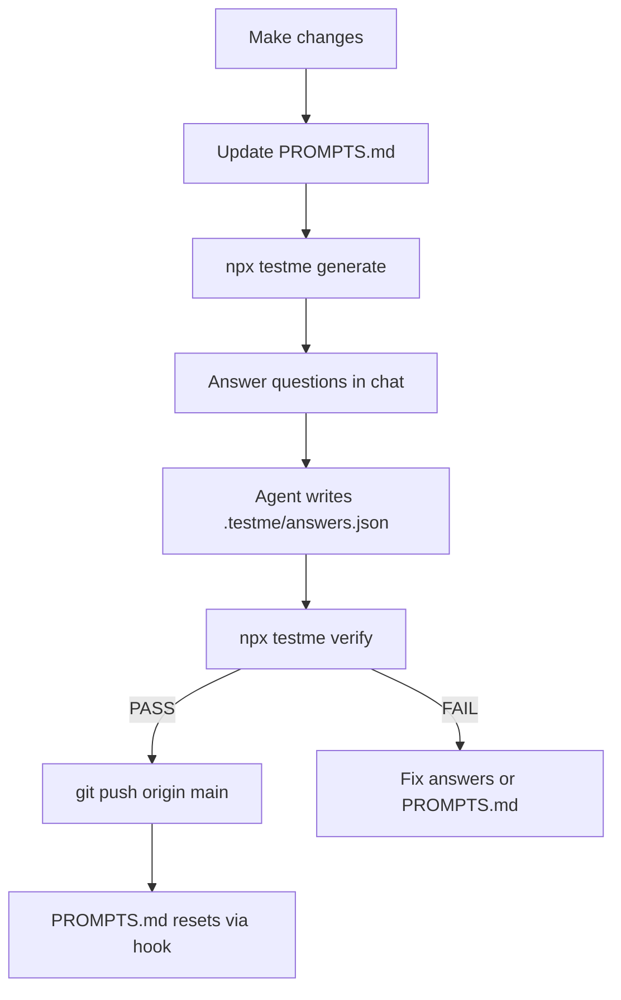

# testme

Comprehension gate for desktop coding agents. **testme** blocks `git commit` (when enabled) and `git push` to protected branches until you pass a comprehension test describing what changed.

## Quick start

```bash
npx testme init
```

This installs into your repo:

- `SUMMARY.md` — stable project map (stack, architecture, conventions)
- `PROMPTS.md` — session change log (resets after successful push to `main`)
- `.cursor/hooks.json` — blocks commit/push in the Cursor agent
- `.git/hooks/pre-commit` and `pre-push` — blocks commit/push in any terminal (installed by `init`)
- `.cursor/skills/testme/SKILL.md` — `/testme` workflow for agents

## Workflow



### 1. Document changes in PROMPTS.md

```markdown
# Session Changes

## src/auth.ts
- Added validateToken middleware; checks JWT expiry before route handlers
```

Write bullets as you work — they become the answer rubric.

### 2. Generate questions

```bash
npx testme generate
```

Reads `SUMMARY.md`, `PROMPTS.md`, and git diff only. Produces 3–5 targeted questions in `.testme/session.json`.

### 3. Answer questions (in chat)

Run `/testme` in Cursor. The agent asks each question one at a time in chat — reply in plain messages. The agent writes `.testme/answers.json` from your replies before verifying.

For each question, read only the files listed in that question's `files[]` array if you need to check your answer.

### 4. Verify (semantic grading)

The agent generates reference answers, asks you questions in chat, then grades your replies with an **accuracy score (0–100)** and **alignment** (`low` / `medium` / `high`) per question. Default pass threshold is **70%** accuracy (`passThreshold` in config).

```bash
npx testme verify
```

On pass, `.testme/pass.json` is written.

### 5. Push

```bash
git push origin main
```

After a successful push, `PROMPTS.md` resets automatically.

## Commands

| Command | Description |
|---------|-------------|
| `testme init` | Install templates, Cursor hooks, git hooks, skill, and `testme.config.json` |
| `testme hook install-git` | Re-install git `pre-commit` / `pre-push` hooks only |
| `testme generate` | Generate questions from diff + md files |
| `testme generate --max-questions 3` | One-off question count override |
| `testme generate --category runtime,testing` | One-off category filter |
| `testme detect` | Show auto-detected domain categories |
| `testme config init` | Create `testme.config.json` with detected defaults |
| `testme config show` | Print merged config (repo + local overrides) |
| `testme verify` | Score answers in `.testme/answers.json` |
| `testme status` | Check if current pass is valid |
| `testme reset` | Clear `.testme/` session state |

## Customization

### Protected branches and commit gating

Configure in `testme.config.json`:

```json
{
  "protectedBranches": ["main"],
  "gateCommits": true,
  "autoProtectCurrentBranch": true
}
```

- `protectedBranches` — always-protected branches (e.g. `main`)
- `autoProtectCurrentBranch` — also gate pushes to whatever branch you have checked out (default `true`)
- `gateCommits` — when `true`, `git commit` is blocked until `/testme` passes

Blocked push message: `You must run the /testme skill before pushing to 'main'.`

**Terminal blocking:** `npx testme init` installs native git hooks into `.git/hooks/`. The Cursor integrated terminal does **not** run Cursor `beforeShellExecution` hooks — git hooks cover that gap.

### Question count

Configure in `testme.config.json`:

```json
{
  "questions": { "min": 2, "max": 5 }
}
```

Local override in `.testme/config.json` (gitignored via `.testme/`):

```json
{ "questions": { "max": 3 } }
```

### Category checkboxes

Each category is a boolean in `categories`. Core categories work everywhere; domain categories are auto-suggested when relevant.

| Category | Focus |
|----------|-------|
| `changeRationale` | What changed per file and why |
| `symbols` | What added/changed symbols do |
| `architecture` | Fit with SUMMARY.md structure |
| `runtime` | Run, test, deploy impact |
| `dataStructures` | Algorithms and data structures used |
| `dependencies` | Package/manifest changes |
| `testing` | Test coverage and assertions |
| `errorHandling` | Errors and edge cases |
| `apiContracts` | API/schema/interface changes |
| `security` | Auth, validation, secrets |
| `performance` | Caching, complexity, bottlenecks |
| `database` | Schema, queries, migrations |
| `machineLearning` | Training, inference, metrics |
| `cybersecurity` | Threat model, mitigations |
| `frontend` | UI components and state |
| `backend` | Routes, middleware, services |
| `devops` | CI/CD, containers, infra |
| `mobile` | Platform-specific behavior |
| `dataEngineering` | Pipelines, ETL, lineage |

### Project-aware detection

```bash
npx testme detect
```

Signals: `SUMMARY.md` `## Domain` section, `package.json`/`pyproject.toml` deps, diff file paths.

**ML example** — `testme detect` enables `machineLearning`; disable `cybersecurity` in config.

**Security example** — enable `cybersecurity` and `security`; leave `machineLearning` false.

```json
{
  "autoDetect": true,
  "categories": {
    "machineLearning": true,
    "dataStructures": true,
    "cybersecurity": false
  }
}
```

Add to `SUMMARY.md`:

```markdown
## Domain

- Primary: machine learning
- Focus areas: model training, evaluation metrics, inference API
```

## Why PROMPTS.md matters

`PROMPTS.md` is the cheap answer key. Agents document changes as they work, so verification doesn't require re-reading full diffs or scanning the codebase. Better bullets → better rubrics → easier pass.

## Token efficiency

- No full-repo scans — only git diff metadata + two md files
- Configurable question count and categories via `testme.config.json`
- Semantic grading by default (agent compares your answers to reference answers)
- Targeted file reads via `files[]` pointers in session

## Troubleshooting

| Issue | Fix |
|-------|-----|
| Push blocked | Run `/testme` or `npx testme generate` → answer → `verify` |
| Commit blocked | `gateCommits` is on — run `/testme` before committing |
| Session stale | Re-run `generate` after new edits |
| Missing terms | Add clearer bullets to `PROMPTS.md` |
| Pass invalid | `npx testme status` — diff changed since verify |

## Development

```bash
npm install
npm run build
npm test
```

## Limitations (v1)

- Symbol extraction uses regex (TS/JS/Python/Go patterns) — not a full AST parser
- Protected branches configurable via `protectedBranches` in `testme.config.json` (`--branch` flag to override)
- Optional commit gating via `gateCommits: true` in `testme.config.json`
- Verification is semantic by default (`grading: "semantic"`); legacy keyword mode available
