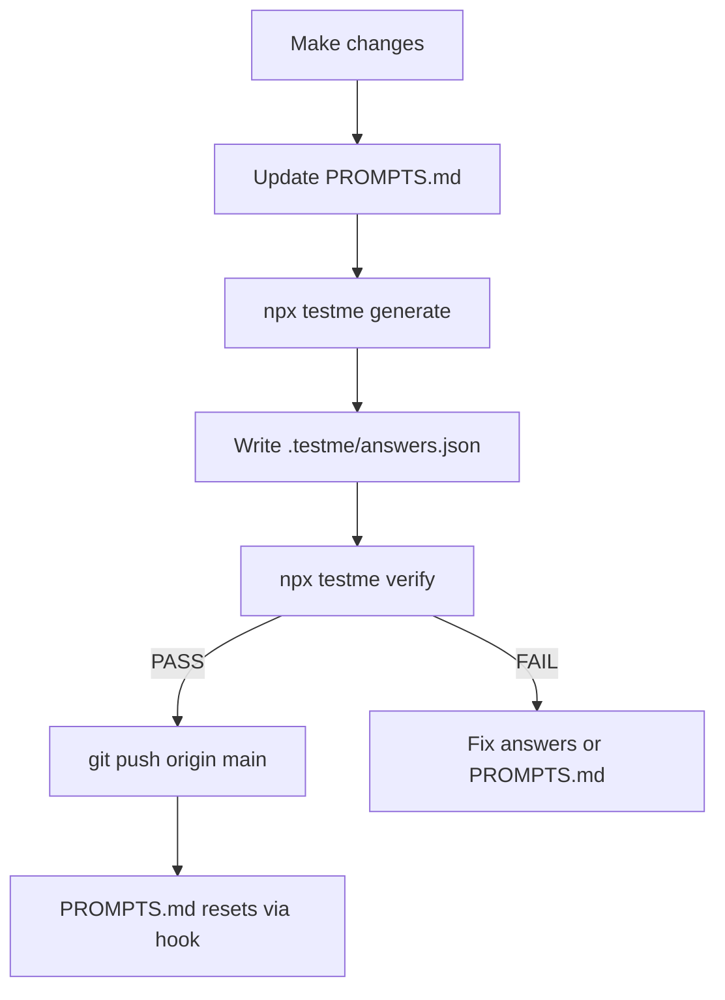

# testme

Comprehension gate for desktop coding agents. **testme** blocks `git push` to `main` until you pass a deterministic test describing what changed — no LLM judge, minimal token use.

## Quick start

```bash
npx testme init
```

This installs into your repo:

- `SUMMARY.md` — stable project map (stack, architecture, conventions)
- `PROMPTS.md` — session change log (resets after successful push to `main`)
- `.cursor/hooks.json` — blocks push until verified
- `.cursor/skills/testme/SKILL.md` — `/testme` workflow for agents

## Workflow



### 1. Document changes in PROMPTS.md

```markdown
# Session Changes

## src/auth.ts
- Added validateToken middleware; checks JWT expiry before route handlers
```

Write bullets as you work — they become the answer rubric.

### 2. Generate questions

```bash
npx testme generate
```

Reads `SUMMARY.md`, `PROMPTS.md`, and git diff only. Produces 3–5 targeted questions in `.testme/session.json`.

### 3. Answer questions

Read only the files listed in each question's `files[]` array. Write `.testme/answers.json`:

```json
{
  "q1": "In src/auth.ts I added validateToken middleware to check JWT expiry before handlers run."
}
```

### 4. Verify

```bash
npx testme verify
```

Deterministic keyword matching — no extra LLM calls. On pass, `.testme/pass.json` is written.

### 5. Push

```bash
git push origin main
```

After a successful push, `PROMPTS.md` resets automatically.

## Commands

| Command | Description |
|---------|-------------|
| `testme init` | Install templates, hooks, and skill |
| `testme generate` | Generate questions from diff + md files |
| `testme verify` | Score answers in `.testme/answers.json` |
| `testme status` | Check if current pass is valid |
| `testme reset` | Clear `.testme/` session state |
| `testme hook before-push` | Cursor hook helper (internal) |
| `testme hook after-push` | Reset after push (internal) |

## Why PROMPTS.md matters

`PROMPTS.md` is the cheap answer key. Agents document changes as they work, so verification doesn't require re-reading full diffs or scanning the codebase. Better bullets → better rubrics → easier pass.

## Token efficiency

- No full-repo scans — only git diff metadata + two md files
- Max 5 questions per session
- Targeted file reads via `files[]` pointers in session
- Zero LLM calls for verification

## Troubleshooting

| Issue | Fix |
|-------|-----|
| Push blocked | Run `/testme` or `npx testme generate` → answer → `verify` |
| Session stale | Re-run `generate` after new edits |
| Missing terms | Add clearer bullets to `PROMPTS.md` |
| Pass invalid | `npx testme status` — diff changed since verify |

## Development

```bash
npm install
npm run build
npm test
```

## Limitations (v1)

- Symbol extraction uses regex (TS/JS/Python/Go patterns) — not a full AST parser
- Protected branch defaults to `main` (`--branch` flag to override)
- Verification is keyword-based — write substantive answers with the required terms
